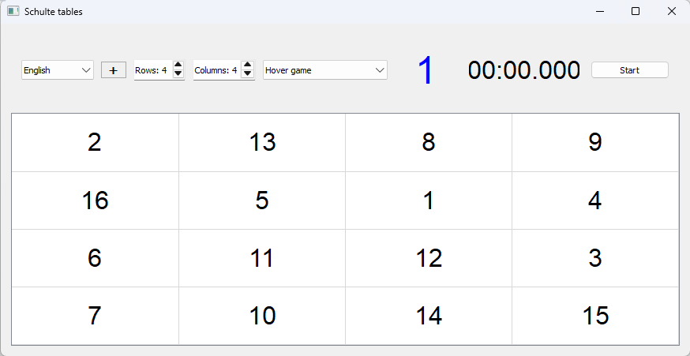

# Schulte Tables

A program for training peripheral vision, attention, and reading speed using Schulte tables.  



## Features

- Generation of Schulte tables in various sizes (from 2x2 to 10x10)
- Multiple operation modes:
  - Click with refresh
  - Click-to-play mode
  - Hover-to-play mode
  - Auto-refresh (every 3, 5, or 10 seconds)
  - Simple mode
- Timer to measure completion time
- Centering dot function (red dot in table center)
- Current target cell highlighting in hover mode

## Installation

1. Ensure you have Python 3.6 or newer installed
2. Install required dependencies:
   ```
   pip install PyQt5
   ```

## Usage

1. Run the program:
   ```
   python main.py
   ```
2. Configure parameters:
   - Select table size (rows and columns)
   - Choose operation mode
   - Press "+" button to show centering dot
3. Click "Start" to begin the exercise
4. Find numbers in ascending order (from 1 to N)

## Hotkeys

- Space: Start/stop exercise

## Implementation Details

- Optimized PyQt5 interface
- Separate overlay for centering dot that doesn't interfere with interaction
- Support for different operation modes
- Customizable visual parameters (colors, fonts) in application configuration

## System Requirements

- OS: Windows/Linux/macOS
- Python: 3.6+
- Dependencies: PyQt5

## 🌍 Available Translations | Доступные переводы | 可用翻译
- 🇬🇧 [English](Readme.md) - English version  
- 🇷🇺 [Русский](Readme_ru.md) - Russian version  
- 🇨🇳 [中文](Readme_ch.md) - Chinese version

## License

MIT
